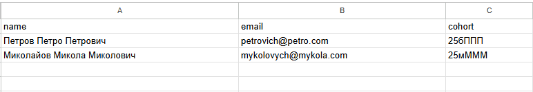
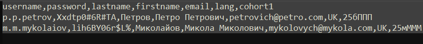
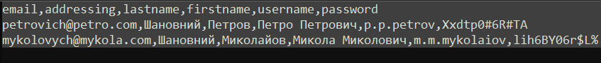
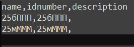

## Moodle students accounts, email data and cohorts list bulk generator 
I wrote this program to help myself and save time when I need to add new users to my university's Moodle. Because there are a lot of students, it is much easier to load them with .csv file in bulk.  
And the most important remark - <ins>I live in Ukraine, my university is located in Ukraine, we use ukrainian language.</ins>  So my program will be useful as is only for my ukrainian colleagues.  
The program was created specifically for my work tasks, taking into account the specifics of our Moodle and the method of mailing. But feel free to take this as a base for your customization. I will be happy, if this will help someone in their work.

What this program does:
1. Takes .csv file with last name, first name, patronymic in ukrainian language, email address and cohort;

2. To create Moodle login - transliterates full name to english language and makes login from initials and last name;

3. Generates password using Web API (API Ninjas with profile API key) or local password generator;

4. Writes full name in ukrainian language, adds email address and cohort for current user from input .csv file;

5. Generates second .csv with information for emails. I use Mozilla Thunderbird with Mail Merge add-on.

6. Generates third .csv with all cohorts from the input file, so I can add them to the Moodle in bulk.

7. Generates a fourth .csv file with all duplicate users if any are present, so that users can be added to them manually later.

## Examples

Input .csv needs only three headers - name,email,cohort

First .csv output will look like this. The headernames corresponds to my Moodle preferences.

Second .csv output will look like this. The headernames corresponds to my Mozilla Thunderbird draft message and Mail Merge add-on.  
Specifically, I use a letter template with placeholders for data from .csv files. And these headernames correspond to placeholders in letter template.

Third .csv output will look like this. This file is just to load new cohorts to Moodle in bulk.

## Requirements

The program was created and tested on Python 3.10  
External libraries used:
- [beautifulsoup4](https://pypi.org/project/beautifulsoup4/)
- [requests](https://pypi.org/project/requests/)

## Usage
The program runs from CLI, typical usage is: 
`python moodle_bulk_gen.py -i <input_file.csv> -o <output_file.csv> -la (optional)` 
`-la` - use local password generator